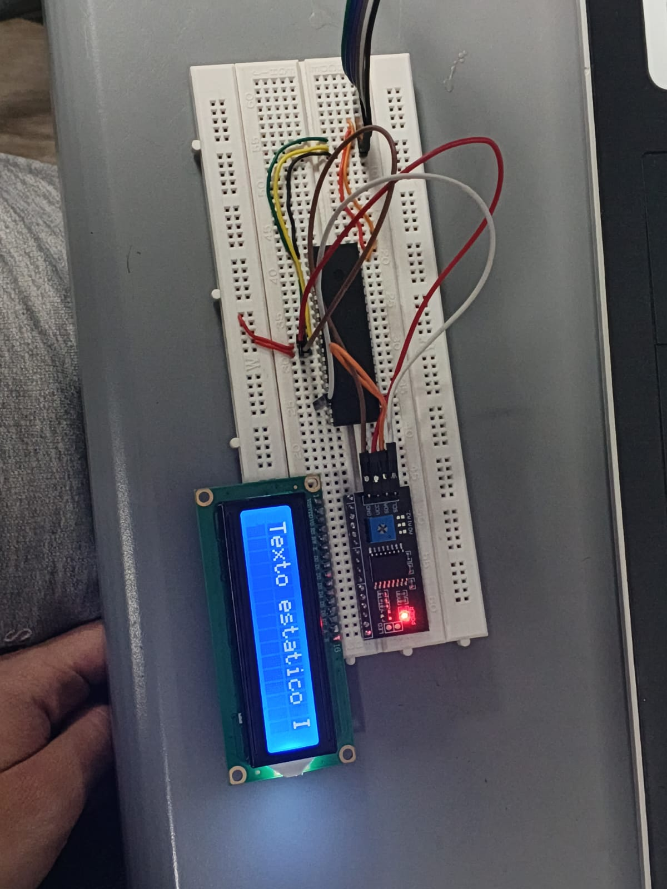

[](https://classroom.github.com/a/rb0M7Pn8)
[](https://classroom.github.com/online_ide?assignment_repo_id=23875478&assignment_repo_type=AssignmentRepo)
# Lab07: Visualización en LCD 16x2 usando módulo I²C con microcontrolador PIC


## Integrantes
* [Juan Camilo Martin Neira](https://github.com/VoltAiSolutions)
* [Angie Daniela Ramirez Rosas](https://github.com/AngieRamirezRosas)
* [Juan Diego Cervantes Guio](https://github.com/juandicervantesgu-dev)

---

## Contenido

- [Introducción](#introducción)
- [Objetivos](#objetivos)
- [Materiales Utilizados](#materiales-utilizados)
- [Fundamento Teórico](#fundamento-teórico)
- [Configuración I²C](#configuración-i²c)
- [Control de LCD](#control-de-lcd)
- [Visualización ADC + PWM + UART](#visualización-adc--pwm--uart)
- [Caracteres Personalizados](#caracteres-personalizados)
- [Conexiones y Evidencias](#conexiones-y-evidencias)
- [Preguntas](#preguntas)
- [Conclusiones](#conclusiones)
- [Referencias](#referencias)

---

# Introducción

En este laboratorio se implementó la comunicación entre un microcontrolador **PIC18F45K22** y una pantalla **LCD 16x2** utilizando el protocolo **I²C** mediante el módulo expansor **PCF8574**.

A diferencia del control paralelo tradicional de una LCD, donde se requieren entre 6 y 8 pines del microcontrolador, el uso del protocolo I²C permite controlar la pantalla utilizando únicamente dos líneas de comunicación:

- SDA → Datos
- SCL → Reloj

Durante el desarrollo del laboratorio se configuró el módulo MSSP del PIC en modo maestro I²C, se implementaron funciones para enviar comandos y caracteres hacia la LCD, y se realizaron diferentes pruebas como:

- Texto estático
- Visualización de voltaje ADC
- Control PWM
- Comunicación UART
- Animación de caracteres personalizados

Este laboratorio permitió comprender cómo integrar múltiples periféricos usando un mismo microcontrolador y cómo simplificar el hardware mediante protocolos seriales.

---

# Objetivos

- Configurar el módulo MSSP del PIC18F45K22 en modo I²C Maestro.
- Controlar una pantalla LCD 16x2 usando el módulo PCF8574.
- Implementar funciones para enviar comandos y caracteres vía I²C.
- Mostrar mensajes estáticos y dinámicos en la LCD.
- Integrar ADC, PWM, UART y LCD en un mismo proyecto.
- Crear caracteres personalizados y animaciones en la LCD.

---

# Materiales Utilizados

| Componente | Descripción |
|---|---|
| PIC18F45K22 | Microcontrolador principal |
| PICkit 4 | Programador y debugger |
| LCD 16x2 | Pantalla LCD |
| Módulo PCF8574 | Adaptador I²C para LCD |
| Potenciómetro | Entrada analógica |
| LED | Salida PWM |
| Protoboard | Montaje |
| Jumpers | Conexiones |
| MPLAB X IDE | Entorno de desarrollo |
| XC8 Compiler | Compilador |

---

# Fundamento Teórico

## ¿Qué es I²C?

I²C (Inter-Integrated Circuit) es un protocolo de comunicación serial de dos hilos desarrollado para permitir la comunicación entre múltiples dispositivos utilizando un mismo bus.

Las líneas principales son:

- SDA → Serial Data
- SCL → Serial Clock

---

## ¿Por qué usar I²C?

Sin I²C:

- La LCD necesita entre 6 y 8 pines.

Con I²C:

- Solo se utilizan 2 pines:
  - RC3 → SCL
  - RC4 → SDA

Esto simplifica el hardware y deja más pines disponibles.

---

## Comunicación Half-Duplex

I²C es una comunicación **half-duplex**, lo que significa que:

- solo un dispositivo transmite datos a la vez.

A diferencia de SPI:

- que es **full-duplex**
- y puede enviar y recibir simultáneamente.

---

## Módulo MSSP

El PIC18F45K22 incluye el módulo:

```text
MSSP (Master Synchronous Serial Port)
```

Capaz de trabajar en:

- SPI
- I²C

En este laboratorio se configuró en modo:

```text
I²C Maestro
```

---

# Configuración I²C

## Inicialización I²C

```c
void I2C_Init(void){

    SSPCON1 = 0x28;
    SSPCON2 = 0x00;
    SSPADD = 39;

    SSPSTAT = 0x00;

    TRISC3 = 1;
    TRISC4 = 1;
}
```

---

# Explicación del Código

## SSPCON1 = 0x28

```text
00101000
```

Esto configura:

- MSSP habilitado
- Modo I²C Maestro
- Clock generado por SSPADD

---

## SSPADD

```c
SSPADD = 39;
```

Define la velocidad del reloj I²C.

---

## Pines utilizados

| Pin PIC | Función |
|---|---|
| RC3 | SCL |
| RC4 | SDA |

---

# Funciones I²C

## Condición Start

```c
void I2C_Start(){

    SSPCON2bits.SEN = 1;

    while(!PIR1bits.SSPIF);

    PIR1bits.SSPIF = 0;
}
```

---

## Condición Stop

```c
void I2C_Stop(){

    SSPCON2bits.PEN = 1;

    while(!PIR1bits.SSPIF);

    PIR1bits.SSPIF = 0;
}
```

---

## Escritura de Datos

```c
void I2C_Write(unsigned char data){

    SSPBUF = data;

    while(!PIR1bits.SSPIF);

    PIR1bits.SSPIF = 0;
}
```

---

# Control de LCD

## Dirección del PCF8574

```c
#define LCD_ADDR 0x4E
```

La dirección base del módulo es:

```text
0x27
```

Pero en I²C:

- se desplaza un bit a la izquierda:

```text
0x27 << 1 = 0x4E
```

---

## Mensaje Inicial

Al iniciar el sistema la LCD muestra:

```text
Proyecto Final
ADC+PWM+UART+LCD
```

Esto verifica que:

- la comunicación I²C funciona correctamente
- la LCD fue inicializada exitosamente

---

# Visualización ADC + PWM + UART

El sistema realiza:

- lectura ADC
- conversión a voltaje
- control PWM
- visualización LCD
- envío UART

---

## Conversión ADC

```math
Voltaje = \frac{ADC \times 5.0}{1023}
```

---

## Código Principal

```c
while(1){

    adcVal = ADC_Read();

    voltage = ADC_ToVoltage(adcVal);

    duty = adcVal >> 2;

    PWM_SetDuty(duty);

    sprintf(buffer, "Volt: %.2fV", voltage);

    LCD_SetCursor(1,1);
    LCD_Print(buffer);

    sprintf(buffer2, "PWM:%d", duty);

    LCD_SetCursor(2,1);
    LCD_Print(buffer2);

    UART_WriteString(buffer);

    __delay_ms(100);
}
```

---

# Caracteres Personalizados

La LCD permite almacenar hasta:

```text
8 caracteres personalizados
```

en memoria CGRAM.

---

## Animación de Corazón

Se crearon dos estados:

- corazón pequeño
- corazón grande

alternando rápidamente para simular un latido ❤️

---

## Código de Animación

```c
while(1){

    lcd_set_cursor(1, pos);

    lcd_write_char(heart_state);

    __delay_ms(120);

    lcd_set_cursor(1, pos);

    lcd_write_char(' ');

    heart_state ^= 1;

    pos++;

    if(pos > 15){
        pos = 0;
    }
}
```

---

# Conexiones y Evidencias

## Conexiones I²C

| PIC18F45K22 | Módulo PCF8574 |
|---|---|
| RC3 | SCL |
| RC4 | SDA |
| VCC | VCC |
| GND | GND |

---

## Evidencias de Implementación

### Parte 1 - Texto estático

La LCD mostró correctamente mensajes fijos utilizando comunicación I²C.

---

### Parte 2 - ADC + PWM + UART

- El voltaje cambió al mover el potenciómetro.
- El LED modificó su intensidad usando PWM.
- Los datos se visualizaron correctamente en la LCD.
- La información también fue enviada por UART.

---

### Parte 3 - Caracteres personalizados

Se implementó una animación de corazón usando caracteres personalizados en CGRAM.

---

# Videos de Evidencia


---

## Parte 1

---

# Diagramas

## Diagrama I²C

```text
PIC18F45K22               PCF8574 + LCD
┌────────────┐           ┌─────────────┐
│            │           │             │
│ RC3 (SCL) ───────────► SCL           │
│ RC4 (SDA) ───────────► SDA           │
│ GND       ───────────► GND           │
│ VCC       ───────────► VCC           │
└────────────┘           └─────────────┘
```

---

# Preguntas

## 1. ¿Por qué I²C es half-duplex y SPI full-duplex?

I²C utiliza una sola línea de datos compartida (SDA), por lo que únicamente un dispositivo puede transmitir información a la vez. Esto hace que la comunicación sea half-duplex.

SPI utiliza líneas independientes para transmisión y recepción:

- MOSI
- MISO

permitiendo enviar y recibir datos simultáneamente, siendo full-duplex.

En una LCD esto no afecta demasiado porque normalmente solo se envían comandos y caracteres hacia la pantalla.

---

## 2. Desglose de SSPCON1 = 0x28

```text
0x28 = 00101000
```

Bits importantes:

- SSPEN = 1 → habilita MSSP
- SSPM3:SSPM0 = 1000 → modo I²C Maestro

Se usa este valor para habilitar el módulo MSSP en modo maestro I²C.

---

## 3. ¿Qué representa SSPIF?

SSPIF es una bandera de interrupción que indica:

- operación I²C finalizada.

Se limpia después de cada operación para permitir detectar correctamente la siguiente transmisión.

---

## 4. ¿Qué hace PBADEN = OFF?

Deshabilita el modo analógico del puerto B.

Si estuviera en ON:

- algunos pines iniciarían como entradas analógicas,
- causando problemas al usarlos como salidas digitales.

---

## 5. LCD Paralelo vs LCD I²C

| Característica | LCD Paralelo | LCD I²C |
|---|---|---|
| Pines usados | 6-8 | 2 |
| Velocidad | Mayor | Menor |
| Complejidad hardware | Alta | Baja |
| Complejidad software | Baja | Media |

---

## 6. ¿Cómo agregar otro PCF8574?

Solo sería necesario:

### Hardware
Cambiar la dirección del módulo usando los pines:

```text
A0, A1, A2
```

### Código

Definir una nueva dirección:

```c
#define LCD2_ADDR 0x4F
```

---

# imagen y video 



<video controls src="WhatsApp Video 2026-05-25 at 8.22.09 PM.mp4" title="Title"></video>


# Conclusiones

Este laboratorio permitió comprender cómo controlar una pantalla LCD mediante comunicación I²C usando únicamente dos líneas de conexión.

Se logró configurar correctamente el módulo MSSP del PIC18F45K22 y establecer comunicación con el módulo PCF8574, reduciendo significativamente la cantidad de pines utilizados respecto al modo paralelo.

Además, se integraron distintos periféricos como ADC, PWM, UART y LCD en un mismo sistema, demostrando cómo múltiples módulos pueden trabajar simultáneamente en aplicaciones embebidas.

Finalmente, se implementaron caracteres personalizados y animaciones, ampliando las capacidades gráficas de la LCD y fortaleciendo el entendimiento del manejo interno de la pantalla.

---

# Referencias

- Datasheet PIC18F45K22
- Datasheet PCF8574
- MPLAB X IDE Documentation
- XC8 Compiler User Guide
- Protocolo I²C
- Guía de laboratorio proporcionada por el docente